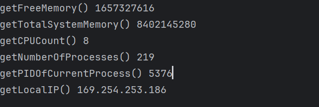

# Sys Info
Shows basic System information

### How to run
```shell
go run main.go
```

### Sample output
 

### What I have learnt
1. How to get PID of current processes
2. How to calculate the total memory allocation in a computer
3. How to get the IPV4 of a computer
4. How to determine the number of running processes in a computer
5. How to determine the CPU count
6. How to get the available memory in a computer